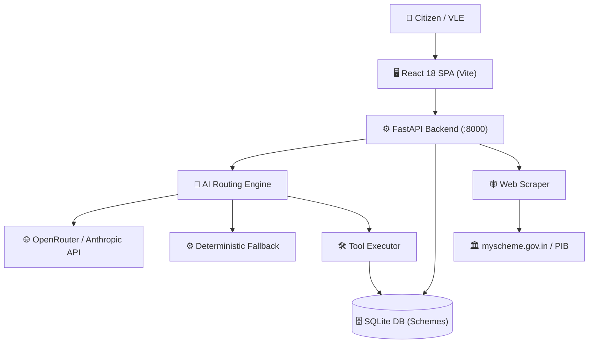

# SETU (सेतु) — One Voice. Every Service.

> **National AI-Powered Government Schemes Discovery Portal**  
> *A production-ready prototype empowering Indian citizens to discover, verify, and access government welfare entitlements through natural conversation in 12 Indian languages.*

<!-- <div align="center">
  
</div> -->

## Overview
SETU (सेतु) is an AI-powered multilingual government service discovery platform that helps citizens discover schemes, benefits, certificates, public services, and eligibility information through conversational AI, voice interaction, life-event-based guidance, and accessibility-first experiences.

## Problem Statement
Indian citizens struggle to discover government schemes, benefits, documents, and public services due to:
- **Fragmented Portals:** Information is scattered across dozens of central and state ministry websites.
- **Low Awareness:** Citizens are often unaware of the entitlements they are eligible for.
- **Language Barriers:** Official documents are often in English or formal Hindi, making them inaccessible to rural populations.
- **Digital Literacy Challenges:** Navigating complex government forms and UI is difficult for many.

## Solution
SETU solves this problem by providing a unified, conversational interface:
- **AI Assistance:** A conversational agent that acts as a citizen service guide.
- **Voice Interaction:** Web Speech API integration allows users to speak their needs instead of typing.
- **Multilingual Support:** Native support for 12 Indian languages, breaking down language barriers.
- **Life Event Engine:** Discovers schemes based on major life milestones (birth, education, marriage, etc.).
- **Guided Discovery:** An intuitive 4-step eligibility wizard that calculates match probabilities.
- **Accessibility Features:** GIGW & WCAG 2.0 AA compliance with font scaling and high-contrast modes.

## Key Features

### Multilingual Voice Assistant
Real-time Server-Sent Events (SSE) chat with voice input. Communicates in the user's native language and provides structured, actionable responses.

### Life Event Engine
Navigate services based on life stages (e.g., Birth, Education, Marriage, Retirement). Instantly surfaces relevant schemes (e.g., Sukanya Samriddhi for a newborn daughter).

### Help Me Find What I Need
An intelligent Eligibility Wizard. Users provide basic demographic details (Age, Gender, State, Income, Category) and receive a real-time match score for 700+ schemes.

### Government Scheme Discovery
A comprehensive, searchable, and filterable directory of schemes. Includes a live web-scraping module that pulls real-time updates and scheme details from official portals like myscheme.gov.in.

### Service Discovery
Directory of verified official government portals with direct "Apply Now" links, bridging the gap between discovery and action.

### Eligibility Assistance
The AI agent uses tools to check eligibility against strict database criteria (age limits, income ceilings, domicile requirements) and provides a clear breakdown of met/unmet conditions.

### Accessibility Features
Built with inclusivity in mind: top accessibility bar allows users to increase/decrease font size and switch to a high-contrast mode for visually impaired users.

### Citizen Journey Guidance
A dynamic 5-state right context panel in the chat interface that adapts to the conversation (Idle, Schemes List, Document Checklist, DigiLocker Auth, Eligibility Breakdown).

## Innovation Highlights
- **Intent-Based Discovery:** The AI understands intent (e.g., "I need money for my daughter's college") rather than relying on exact keyword matches.
- **Voice-First Government Access:** Removes typing friction for rural or elderly users.
- **Deterministic Fallback Engine:** The system functions 100% even if the primary LLM API (OpenRouter/Anthropic) goes down, using a localized conversational routing engine.
- **DigiLocker Integration (Simulated):** Seamlessly connects to verify identity and check Direct Benefit Transfer (DBT) payment status securely.

## System Architecture



## Quick Start

1. **Clone & Setup:**
   ```bash
   git clone https://github.com/maheshMadiwalar18/setu_bfb.git
   cd setu_bfb
   ```
2. **Start Servers (Windows):**
   ```bash
   .\start.bat
   ```
3. **Manual Start:**
   - Backend: `cd backend && pip install -r requirements.txt && python run.py`
   - Frontend: `cd frontend && npm install && npm run dev`
